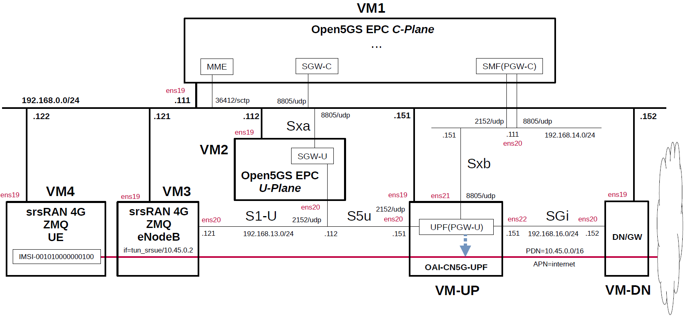

# Open5GS EPC & srsRAN_4G with ZeroMQ UE / RAN Sample Configuration - OAI-CN5G-UPF(PGW-U)
This describes a simple configuration for working Open5GS EPC and OAI-CN5G-UPF(PGW-U).
In particular, see [here](https://github.com/s5uishida/install_oai_upf) for OAI-CN5G-UPF.

---

### [Sample Configurations and Miscellaneous for Mobile Network](https://github.com/s5uishida/sample_config_misc_for_mobile_network)

---

<a id="toc"></a>

## Table of Contents

- [Overview of Open5GS CUPS-enabled EPC Simulation Mobile Network](#overview)
- [Changes in configuration files of Open5GS EPC, OAI-CN5G-UPF and srsRAN_4G ZMQ UE / RAN](#changes)
  - [Changes in configuration files of Open5GS EPC C-Plane](#changes_cp)
  - [Changes in configuration files of Open5GS EPC U-Plane](#changes_up)
  - [Changes in configuration files of OAI-CN5G-UPF](#changes_pgwu)
  - [Changes in configuration files of srsRAN_4G ZMQ UE / RAN](#changes_srs)
    - [Changes in configuration files of RAN](#changes_ran)
    - [Changes in configuration files of UE](#changes_ue)
- [Network settings of Open5GS EPC, OAI-CN5G-UPF and srsRAN_4G ZMQ UE / RAN](#network_settings)
  - [Network settings of OAI-CN5G-UPF and Data Network Gateway](#network_settings_pgwu)
- [Build Open5GS, OAI-CN5G-UPF and srsRAN_4G ZMQ UE / RAN](#build)
- [Run Open5GS EPC, OAI-CN5G-UPF and srsRAN_4G ZMQ UE / RAN](#run)
  - [Run OAI-CN5G-UPF](#run_pgwu)
  - [Run Open5GS EPC U-Plane](#run_up)
  - [Run Open5GS EPC C-Plane](#run_cp)
  - [Run srsRAN_4G ZMQ RAN](#run_ran)
  - [Run srsRAN_4G ZMQ UE](#run_ue)
- [Ping google.com](#ping)
  - [Case for going through PDN 10.45.0.0/16](#ping_1)
- [Changelog (summary)](#changelog)

---

<a id="overview"></a>

## Overview of Open5GS CUPS-enabled EPC Simulation Mobile Network

This describes a simple configuration of C-Plane, OAI-CN5G-UPF and Data Network Gateway for Open5GS EPC.
**Note that this configuration is implemented with Proxmox VE VMs.**

The following minimum configuration was set as a condition.
- One SGW-U/UPF(PGW-U) and Data Network Gateway
- One UE and one APN

The built simulation environment is as follows.

</img>

The EPC / PGW-U / UE / RAN used are as follows.
- EPC - Open5GS v2.8.0 (2026.09.26) - https://github.com/open5gs/open5gs
- PGW-U - OAI-CN5G-UPF v2.2.1 (2026.09.09) - https://github.com/openairinterface/oai-cn5g-upf
- UE / RAN - srsRAN_4G (2026.09.10) - https://github.com/srsran/srsRAN_4G

Each VMs are as follows.  
| VM | SW & Role | IP address | OS | CPU<br>(Min) | Mem<br>(Min) | HDD<br>(Min) |
| --- | --- | --- | --- | --- | --- | --- |
| VM1 | Open5GS EPC C-Plane | 192.168.0.111/24 | Ubuntu 24.04 | 1 | 2GB | 20GB |
| VM2 | Open5GS EPC U-Plane (SGW-U) | 192.168.0.112/24 | Ubuntu 24.04 | 1 | 1GB | 20GB |
| VM-UP | OAI-CN5G-UPF (PGW-U) | 192.168.0.151/24 | Ubuntu 24.04 | 1 | 6GB | 20GB |
| VM-DN | Data Network Gateway  | 192.168.0.152/24 | Ubuntu 24.04 | 1 | 1GB | 10GB |
| VM3 | srsRAN_4G ZMQ RAN (eNodeB) | 192.168.0.121/24 | Ubuntu 24.04 | 1 | 2GB | 10GB |
| VM4 | srsRAN_4G ZMQ UE | 192.168.0.122/24 | Ubuntu 24.04 | 1 | 2GB | 10GB |

The network interfaces of each VM are as follows.
| VM | Device | Model | Linux Bridge | IP address | Interface | XDP |
| --- | --- | --- | --- | --- | --- | --- |
| VM1 | ens18 | VirtIO | vmbr1 | 10.0.0.111/24 | (NAPT NW) | -- |
| | ens19 | VirtIO | mgbr0 | 192.168.0.111/24 | (Mgmt NW) | -- |
| | ens20 | VirtIO | vmbr4 | 192.168.14.111/24 | Sxb (N4 for 5GC) | -- |
| VM2 | ens18 | VirtIO | vmbr1 | 10.0.0.112/24 | (NAPT NW) | -- |
| | ens19 | VirtIO | mgbr0 | 192.168.0.112/24 | (Mgmt NW) | -- |
| | ens20 | VirtIO | vmbr3 | 192.168.13.112/24 | S1-U,S5u (N3 for 5GC) | -- |
| VM-UP | ~~ens18~~ | ~~VirtIO~~ | ~~vmbr1~~ | ~~10.0.0.151/24~~ | ~~(NAPT NW)~~ ***down*** | -- |
| | ens19 | VirtIO | mgbr0 | 192.168.0.151/24 | (Mgmt NW) | -- |
| | ens20 | VirtIO | vmbr3 | 192.168.13.151/24 | S5u (N3 for 5GC) | x |
| | ens21 | VirtIO | vmbr4 | 192.168.14.151/24 | Sxb (N4 for 5GC) | -- |
| | ens22 | VirtIO | vmbr6 | 192.168.16.151/24 | SGi (N6 for 5GC) | x |
| VM-DN | ens18 | VirtIO | vmbr1 | 10.0.0.152/24 | (NAPT NW) | -- |
| | ens19 | VirtIO | mgbr0 | 192.168.0.152/24 | (Mgmt NW) | -- |
| | ens20 | VirtIO | vmbr6 | 192.168.16.152/24 | SGi (N6 for 5GC),<br>***default GW for VM-UP*** | -- |
| VM3 | ens18 | VirtIO | vmbr1 | 10.0.0.121/24 | (NAPT NW) | -- |
| | ens19 | VirtIO | mgbr0 | 192.168.0.121/24 | (Mgmt NW) | -- |
| | ens20 | VirtIO | vmbr3 | 192.168.13.121/24 | S1-U (N3 for 5GC) | -- |
| VM4 | ens18 | VirtIO | vmbr1 | 10.0.0.122/24 | (NAPT NW) | -- |
| | ens19 | VirtIO | mgbr0 | 192.168.0.122/24 | (Mgmt NW) | -- |

Linux Bridges of Proxmox VE are as follows.
| Linux Bridge | Network CIDR | Interface |
| --- | --- | --- |
| vmbr1 | 10.0.0.0/24 | NAPT NW |
| mgbr0 | 192.168.0.0/24 | Mgmt NW |
| vmbr3 | 192.168.13.0/24 | S1-U,S5u for EPC |
| vmbr4 | 192.168.14.0/24 | Sxb for EPC |
| vmbr6 | 192.168.16.0/24 | SGi for EPC |

Subscriber Information (other information is the same) is as follows.  
| UE | IMSI | APN | OP/OPc |
| --- | --- | --- | --- |
| UE | 001010000000100 | internet | OPc |

I registered these information with the Open5GS WebUI.
In addition, [3GPP TS 35.208](https://www.3gpp.org/DynaReport/35208.htm) "4.3 Test Sets" is published by 3GPP as test data for the 3GPP authentication and key generation functions (MILENAGE).

The PDN is as follows.
| PDN | APN | TUNnel interface of UE |
| --- | --- | --- |
| 10.45.0.0/16 | internet | tun_srsue |

The main information of eNodeB is as follows.
| MCC | MNC | TAC | eNodeB ID | Cell ID | E-UTRAN Cell ID |
| --- | --- | --- | --- | --- | --- |
| 001 | 01 | 1 | 0x19b | 0x01 | 0x19b01 |

<a id="changes"></a>

## Changes in configuration files of Open5GS EPC, OAI-CN5G-UPF and srsRAN_4G ZMQ UE / RAN

Please refer to the following for building Open5GS, OAI-CN5G-UPF and srsRAN_4G ZMQ respectively.
- Open5GS v2.8.0 (2026.09.26) - https://github.com/open5gs/open5gs
- OAI-CN5G-UPF v2.2.1 (2026.09.09) - https://github.com/s5uishida/install_oai_upf
- srsRAN_4G (2026.09.10) - https://github.com/s5uishida/build_srsran_4g_zmq_disable_rf_plugins

<a id="changes_cp"></a>

### Changes in configuration files of Open5GS EPC C-Plane

The following parameters can be used in the logic that selects SGW-U and UPF(PGW-U) as the connection destination by PFCP.

- APN
- TAC (Tracking Area Code)
- e_CellID

For the sake of simplicity, I used only APN this time.

- `open5gs/install/etc/open5gs/mme.yaml`
```diff
--- mme.yaml.orig       2026-09-28 21:38:45.000000000 +0900
+++ mme.yaml    2026-09-28 22:17:48.156163006 +0900
@@ -12,7 +12,7 @@
   freeDiameter: /root/open5gs/install/etc/freeDiameter/mme.conf
   s1ap:
     server:
-      - address: 127.0.0.2
+      - address: 192.168.0.111
   gtpc:
     server:
       - address: 127.0.0.2
@@ -27,14 +27,14 @@
         port: 9090
   gummei:
     - plmn_id:
-        mcc: 999
-        mnc: 70
+        mcc: 001
+        mnc: 01
       mme_gid: 2
       mme_code: 1
   tai:
     - plmn_id:
-        mcc: 999
-        mnc: 70
+        mcc: 001
+        mnc: 01
       tac: 1
   security:
     integrity_order : [ EIA2, EIA1, EIA0 ]
```
- `open5gs/install/etc/open5gs/sgwc.yaml`
```diff
--- sgwc.yaml.orig      2025-01-15 04:12:06.000000000 +0900
+++ sgwc.yaml   2025-12-14 00:16:53.080371526 +0900
@@ -14,10 +14,11 @@
       - address: 127.0.0.3
   pfcp:
     server:
-      - address: 127.0.0.3
+      - address: 192.168.0.111
     client:
       sgwu:
-        - address: 127.0.0.6
+        - address: 192.168.0.112
+          apn: internet
 
 ################################################################################
 # GTP-C Server
```
- `open5gs/install/etc/open5gs/smf.yaml`
```diff
--- smf.yaml.orig       2025-01-15 04:12:06.000000000 +0900
+++ smf.yaml    2025-01-15 04:26:29.000000000 +0900
@@ -9,27 +9,19 @@
 #    peer: 64
 
 smf:
-  sbi:
-    server:
-      - address: 127.0.0.4
-        port: 7777
-    client:
-#      nrf:
-#        - uri: http://127.0.0.10:7777
-      scp:
-        - uri: http://127.0.0.200:7777
   pfcp:
     server:
-      - address: 127.0.0.4
+      - address: 192.168.14.111
     client:
       upf:
-        - address: 127.0.0.7
+        - address: 192.168.14.151
+          dnn: internet
   gtpc:
     server:
       - address: 127.0.0.4
   gtpu:
     server:
-      - address: 127.0.0.4
+      - address: 192.168.14.111
   metrics:
     server:
       - address: 127.0.0.4
@@ -37,13 +29,10 @@
   session:
     - subnet: 10.45.0.0/16
       gateway: 10.45.0.1
-    - subnet: 2001:db8:cafe::/48
-      gateway: 2001:db8:cafe::1
+      dnn: internet
   dns:
     - 8.8.8.8
     - 8.8.4.4
-    - 2001:4860:4860::8888
-    - 2001:4860:4860::8844
   mtu: 1400
 #  p-cscf:
 #    - 127.0.0.1
```

<a id="changes_up"></a>

### Changes in configuration files of Open5GS EPC U-Plane

- `open5gs/install/etc/open5gs/sgwu.yaml`
```diff
--- sgwu.yaml.orig      2025-11-20 05:59:10.000000000 +0900
+++ sgwu.yaml   2026-08-30 21:02:44.705000000 +0900
@@ -11,13 +11,13 @@
 sgwu:
   pfcp:
     server:
-      - address: 127.0.0.6
+      - address: 192.168.0.112
     client:
 #      sgwc:    # SGW-U PFCP Client try to associate SGW-C PFCP Server
 #        - address: 127.0.0.3
   gtpu:
     server:
-      - address: 127.0.0.6
+      - address: 192.168.13.112
 
 ################################################################################
 # PFCP Server
```

<a id="changes_pgwu"></a>

### Changes in configuration files of OAI-CN5G-UPF

See [here](https://github.com/s5uishida/install_oai_upf#conf) for the original file.
In addition, refer [here](https://github.com/s5uishida/install_oai_upf#ss_conf) to switch to Simple Switch mode.

<a id="changes_srs"></a>

### Changes in configuration files of srsRAN_4G ZMQ UE / RAN

<a id="changes_ran"></a>

#### Changes in configuration files of RAN

- `srsRAN_4G/build/srsenb/enb.conf`
```diff
--- enb.conf.example    2026-01-26 19:35:53.000000000 +0900
+++ enb.conf    2026-09-29 20:13:31.074984976 +0900
@@ -22,9 +22,9 @@
 enb_id = 0x19B
 mcc = 001
 mnc = 01
-mme_addr = 127.0.1.100
-gtp_bind_addr = 127.0.1.1
-s1c_bind_addr = 127.0.1.1
+mme_addr = 192.168.0.111
+gtp_bind_addr = 192.168.13.121
+s1c_bind_addr = 192.168.0.121
 s1c_bind_port = 0
 n_prb = 50
 #tm = 4
@@ -64,8 +64,8 @@
 #####################################################################
 [rf]
 #dl_earfcn = 3350
-tx_gain = 80
-rx_gain = 40
+tx_gain = 0
+rx_gain = 0
 
 #device_name = auto
 
@@ -80,8 +80,8 @@
 #time_adv_nsamples = auto
 
 # Example for ZMQ-based operation with TCP transport for I/Q samples
-#device_name = zmq
-#device_args = fail_on_disconnect=true,tx_port=tcp://*:2000,rx_port=tcp://localhost:2001,id=enb,base_srate=23.04e6
+device_name = zmq
+device_args = fail_on_disconnect=true,tx_port=tcp://192.168.0.121:2000,rx_port=tcp://192.168.0.122:2001,id=enb,base_srate=23.04e6
 
 #####################################################################
 # Packet capture configuration
```
- `srsRAN_4G/build/srsenb/rr.conf`
```diff
--- rr.conf.example     2026-01-26 19:35:53.000000000 +0900
+++ rr.conf     2026-08-30 19:21:35.330011268 +0900
@@ -55,7 +55,7 @@
   {
     // rf_port = 0;
     cell_id = 0x01;
-    tac = 0x0007;
+    tac = 0x0001;
     pci = 1;
     // root_seq_idx = 204;
     dl_earfcn = 3350;
```

<a id="changes_ue"></a>

#### Changes in configuration files of UE

- `srsRAN_4G/build/srsue/ue.conf`
```diff
--- ue.conf.example     2026-01-26 19:35:53.000000000 +0900
+++ ue.conf     2026-09-29 20:15:04.036905460 +0900
@@ -25,8 +25,8 @@
 #####################################################################
 [rf]
 freq_offset = 0
-tx_gain = 80
-#rx_gain = 40
+tx_gain = 0
+rx_gain = 0
 #srate = 11.52e6
 
 #nof_antennas = 1
@@ -42,8 +42,8 @@
 #continuous_tx     = auto
 
 # Example for ZMQ-based operation with TCP transport for I/Q samples
-#device_name = zmq
-#device_args = tx_port=tcp://*:2001,rx_port=tcp://localhost:2000,id=ue,base_srate=23.04e6
+device_name = zmq
+device_args = tx_port=tcp://192.168.0.122:2001,rx_port=tcp://192.168.0.121:2000,id=ue,base_srate=23.04e6
 
 #####################################################################
 # EUTRA RAT configuration
@@ -139,9 +139,9 @@
 [usim]
 mode = soft
 algo = milenage
-opc  = 63BFA50EE6523365FF14C1F45F88737D
-k    = 00112233445566778899aabbccddeeff
-imsi = 001010123456780
+opc  = E8ED289DEBA952E4283B54E88E6183CA
+k    = 465B5CE8B199B49FAA5F0A2EE238A6BC
+imsi = 001010000000100
 imei = 353490069873319
 #reader =
 #pin  = 1234
@@ -180,8 +180,8 @@
 #                      Supported: 0 - NULL, 1 - Snow3G, 2 - AES, 3 - ZUC
 #####################################################################
 [nas]
-#apn = internetinternet
-#apn_protocol = ipv4
+apn = internet
+apn_protocol = ipv4
 #user = srsuser
 #pass = srspass
 #force_imsi_attach = false
```

<a id="network_settings"></a>

## Network settings of Open5GS EPC, OAI-CN5G-UPF and srsRAN_4G ZMQ UE / RAN

<a id="network_settings_pgwu"></a>

### Network settings of OAI-CN5G-UPF and Data Network Gateway

First, see [this](https://github.com/s5uishida/install_oai_upf#setup_up).  
In addition, enable the routing function as [here](https://github.com/s5uishida/install_oai_upf#network_settings).
Set up DN as [here](https://github.com/s5uishida/install_oai_upf#setup_dn).

<a id="build"></a>

## Build Open5GS, OAI-CN5G-UPF and srsRAN_4G ZMQ UE / RAN

Please refer to the following for building Open5GS, OAI-CN5G-UPF and srsRAN_4G ZMQ UE / RAN respectively.
- Open5GS v2.8.0 (2026.09.26) - https://github.com/open5gs/open5gs
- OAI-CN5G-UPF v2.2.1 (2026.09.09) - https://github.com/s5uishida/install_oai_upf
- srsRAN_4G (2026.09.10) - https://github.com/s5uishida/build_srsran_4g_zmq_disable_rf_plugins

Install MongoDB on Open5GS EPC C-Plane machine.
[MongoDB Compass](https://www.mongodb.com/products/compass) is a convenient tool to look at the MongoDB database.

<a id="run"></a>

## Run Open5GS EPC, OAI-CN5G-UPF and srsRAN_4G ZMQ UE / RAN

First run OAI-CN5G-UPF and EPC U-Plane(SGW-U), then EPC C-Plane, the RAN, and the UE.

<a id="run_pgwu"></a>

### Run OAI-CN5G-UPF

See [this](https://github.com/s5uishida/install_oai_upf#run).
Note that since it will start up in Simple Switch mode, please ignore any operations related to eBPF/XDP.

<a id="run_up"></a>

### Run Open5GS EPC U-Plane

```
./install/bin/open5gs-sgwud &
```

<a id="run_cp"></a>

### Run Open5GS EPC C-Plane

```
./install/bin/open5gs-hssd &
./install/bin/open5gs-pcrfd &
sleep 1
./install/bin/open5gs-mmed &
./install/bin/open5gs-sgwcd &
./install/bin/open5gs-smfd &
```
The PFCP association log between OAI-CN5G-UPF and Open5GS SMF is as follows.
```
[2026-09-29 22:03:34.532] [upf_n4 ] [info] handle_receive(30 bytes)
[2026-09-29 22:03:34.532] [upf_n4 ] [info] Handle SX ASSOCIATION SETUP REQUEST
```

<a id="run_ran"></a>

### Run srsRAN_4G ZMQ RAN

Run srsRAN_4G ZMQ RAN and connect to Open5GS EPC.
```
# cd srsRAN_4G/build/srsenb
# ./src/srsenb enb.conf
---  Software Radio Systems LTE eNodeB  ---

Reading configuration file enb.conf...

Built in Release mode using commit bef8680d5 on branch master.

Opening 1 channels in RF device=zmq with args=fail_on_disconnect=true,tx_port=tcp://192.168.0.121:2000,rx_port=tcp://192.168.0.122:2001,id=enb,base_srate=23.04e6
Supported RF device list: zmq file
CHx base_srate=23.04e6
CHx id=enb
Current sample rate is 1.92 MHz with a base rate of 23.04 MHz (x12 decimation)
CH0 rx_port=tcp://192.168.0.122:2001
CH0 tx_port=tcp://192.168.0.121:2000
CH0 fail_on_disconnect=true

Warning: TX gain was not set. Using open-loop power control (not working properly)

Current sample rate is 11.52 MHz with a base rate of 23.04 MHz (x2 decimation)
Current sample rate is 11.52 MHz with a base rate of 23.04 MHz (x2 decimation)
Setting frequency: DL=2680.0 Mhz, UL=2560.0 MHz for cc_idx=0 nof_prb=50

==== eNodeB started ===
Type <t> to view trace
```
The Open5GS C-Plane log when executed is as follows.
```
09/29 22:05:30.697: [mme] INFO: eNB-S1 accepted[192.168.0.121]:50145 in s1_path module (../src/mme/s1ap-sctp.c:114)
09/29 22:05:30.698: [mme] INFO: eNB-S1 accepted[192.168.0.121] in master_sm module (../src/mme/mme-sm.c:111)
09/29 22:05:30.698: [mme] INFO: [Added] Number of eNBs is now 1 (../src/mme/mme-context.c:3351)
09/29 22:05:30.698: [mme] INFO: eNB-S1[192.168.0.121] max_num_of_ostreams : 30 (../src/mme/mme-sm.c:160)
```

<a id="run_ue"></a>

### Run srsRAN_4G ZMQ UE

Run srsRAN_4G ZMQ UE and connect to Open5GS EPC.
```
# cd srsRAN_4G/build/srsue
# ./src/srsue ue.conf
Reading configuration file ue.conf...

Built in Release mode using commit bef8680d5 on branch master.

Opening 1 channels in RF device=zmq with args=tx_port=tcp://192.168.0.122:2001,rx_port=tcp://192.168.0.121:2000,id=ue,base_srate=23.04e6
Supported RF device list: zmq file
CHx base_srate=23.04e6
CHx id=ue
Current sample rate is 1.92 MHz with a base rate of 23.04 MHz (x12 decimation)
CH0 rx_port=tcp://192.168.0.121:2000
CH0 tx_port=tcp://192.168.0.122:2001

Warning: TX gain was not set. Using open-loop power control (not working properly)

Waiting PHY to initialize ... done!
Attaching UE...
Current sample rate is 1.92 MHz with a base rate of 23.04 MHz (x12 decimation)
Current sample rate is 1.92 MHz with a base rate of 23.04 MHz (x12 decimation)
.
Found Cell:  Mode=FDD, PCI=1, PRB=50, Ports=1, CP=Normal, CFO=-0.2 KHz
Current sample rate is 11.52 MHz with a base rate of 23.04 MHz (x2 decimation)
Current sample rate is 11.52 MHz with a base rate of 23.04 MHz (x2 decimation)
Found PLMN:  Id=00101, TAC=1
Random Access Transmission: seq=10, tti=341, ra-rnti=0x2
RRC Connected
Random Access Complete.     c-rnti=0x46, ta=0
Network attach successful. IP: 10.45.0.2
 nTp) ((t) 29/9/2026 13:6:17 TZ:99
```
The Open5GS C-Plane log when executed is as follows.
```
09/29 22:06:16.737: [mme] INFO: InitialUEMessage (../src/mme/s1ap-handler.c:629)
09/29 22:06:16.737: [mme] INFO: [Added] Number of eNB-UEs is now 1 (../src/mme/mme-context.c:5871)
09/29 22:06:16.737: [mme] INFO: Unknown UE by S_TMSI[G:2,C:1,M_TMSI:0xc00003bc] (../src/mme/s1ap-handler.c:737)
09/29 22:06:16.737: [mme] INFO:     ENB_UE_S1AP_ID[1] MME_UE_S1AP_ID[1] TAC[1] CellID[0x19b01] (../src/mme/s1ap-handler.c:887)
09/29 22:06:16.737: [mme] INFO: Unknown UE by GUTI[G:2,C:1,M_TMSI:0xc00003bc] (../src/mme/mme-context.c:4216)
09/29 22:06:16.737: [mme] INFO: [EBI-TRACK] UE-CREATED ue_id[1] bitmap[0x0000] (../src/mme/mme-context.c:4002)
09/29 22:06:16.737: [mme] INFO: [Added] Number of MME-UEs is now 1 (../src/mme/mme-context.c:4004)
09/29 22:06:16.738: [emm] INFO: [] Attach request (../src/mme/emm-sm.c:489)
09/29 22:06:16.738: [emm] INFO:     GUTI[G:2,C:1,M_TMSI:0xc00003bc] IMSI[Unknown IMSI] (../src/mme/emm-handler.c:291)
09/29 22:06:16.759: [emm] INFO: Identity response (../src/mme/emm-sm.c:459)
09/29 22:06:16.759: [emm] INFO:     IMSI[001010000000100] (../src/mme/emm-handler.c:530)
09/29 22:06:16.826: [mme] INFO: [EBI-TRACK] EBI allocated [5] ue_id[1] IMSI[001010000000100] bitmap[0x0020] (../src/mme/mme-context.c:5686)
09/29 22:06:16.826: [mme] INFO: [EBI-TRACK] Bearer added (EBI=5 ue_id=1 IMSI=001010000000100 bitmap=0x0020) (../src/mme/mme-context.c:5009)
09/29 22:06:16.826: [mme] INFO: [Added] Number of MME-Sessions is now 1 (../src/mme/mme-context.c:5885)
09/29 22:06:16.866: [sgwc] INFO: [Added] Number of SGWC-UEs is now 1 (../src/sgwc/context.c:258)
09/29 22:06:16.867: [sgwc] INFO: Create Session Request (../src/sgwc/s11-handler.c:191)
09/29 22:06:16.867: [sgwc] INFO: [Added] Number of SGWC-Sessions is now 1 (../src/sgwc/context.c:964)
09/29 22:06:16.867: [sgwc] INFO: UE IMSI[001010000000100] APN[internet] (../src/sgwc/s11-handler.c:260)
09/29 22:06:16.867: [sgwc] INFO:     TAI[PLMN_ID:00f110,TAC:1] (../src/sgwc/s11-handler.c:273)
09/29 22:06:16.867: [sgwc] INFO:     E_CGI[PLMN_ID:00f110,CELL_ID:0x19b01] (../src/sgwc/s11-handler.c:276)
09/29 22:06:16.867: [sgwc] INFO:     MME_S11_TEID[762] SGW_S11_TEID[830] (../src/sgwc/s11-handler.c:429)
09/29 22:06:16.867: [sgwc] INFO: Session Establishment Request (../src/sgwc/sxa-build.c:39)
09/29 22:06:16.868: [sgwc] INFO: Session Establishment Response (../src/sgwc/sxa-handler.c:173)
09/29 22:06:16.868: [sgwc] INFO:     SGW_S5C_TEID[0xfe2] PGW_S5C_TEID[0x0] (../src/sgwc/sxa-handler.c:276)
09/29 22:06:16.868: [sgwc] INFO:     SGW_S5U_TEID[53493] PGW_S5U_TEID[0] (../src/sgwc/sxa-handler.c:287)
09/29 22:06:16.868: [gtp] INFO: gtp_connect() [127.0.0.4]:2123 (../lib/gtp/path.c:60)
09/29 22:06:16.868: [smf] INFO: [Added] Number of SMF-UEs is now 1 (../src/smf/context.c:1069)
09/29 22:06:16.868: [smf] INFO: [Added] Number of SMF-Sessions is now 1 (../src/smf/context.c:3665)
09/29 22:06:16.868: [smf] INFO: UE IMSI[001010000000100] APN[internet] IPv4[10.45.0.2] IPv6[] (../src/smf/s5c-handler.c:314)
09/29 22:06:16.872: [gtp] INFO: gtp_connect() [192.168.13.151]:2152 (../lib/gtp/path.c:60)
09/29 22:06:16.872: [sgwc] INFO: Create Session Response (../src/sgwc/s5c-handler.c:117)
09/29 22:06:16.872: [sgwc] INFO:     MME_S11_TEID[762] SGW_S11_TEID[830] (../src/sgwc/s5c-handler.c:252)
09/29 22:06:16.872: [sgwc] INFO:     SGW_S5C_TEID[0xfe2] PGW_S5C_TEID[0x0] (../src/sgwc/s5c-handler.c:254)
09/29 22:06:16.872: [sgwc] INFO:     SGW_S5U_TEID[7472] PGW_S5U_TEID[0] (../src/sgwc/s5c-handler.c:294)
09/29 22:06:16.872: [sgwc] INFO:     sess_id=1 xact=0x7e410f7e7010 (../src/sgwc/s5c-handler.c:350)
09/29 22:06:16.873: [sgwc] INFO: PFCP Session Modification from session: sess_id=1 gtp_xact_id=1 flags=0x60004 (../src/sgwc/pfcp-path.c:414)
09/29 22:06:16.873: [sgwc] INFO: PFCP Session Modification xact: sess_id=1 xact=0x7e410f386110 local_seid=0xfe2 bearer_to_modify_count=1 (../src/sgwc/pfcp-path.c:297)
09/29 22:06:16.873: [sgwc] INFO: Session Modification Request (../src/sgwc/sxa-build.c:149)
09/29 22:06:16.873: [sgwc] INFO: PFCP Session Modification build start: sess_id=1 xact=0x7e410f386110 flags=0x60005 bearer_to_modify_count=1 (../src/sgwc/sxa-build.c:155)
09/29 22:06:16.874: [sgwc] INFO: Session Modification Response (../src/sgwc/sxa-handler.c:488)
09/29 22:06:17.137: [emm] INFO: [001010000000100] Attach complete (../src/mme/emm-sm.c:1615)
09/29 22:06:17.138: [emm] INFO:     IMSI[001010000000100] (../src/mme/emm-handler.c:331)
09/29 22:06:17.138: [emm] INFO:     UTC [2026-09-29T13:06:17] Timezone[0]/DST[0] (../src/mme/emm-handler.c:337)
09/29 22:06:17.138: [emm] INFO:     LOCAL [2026-09-29T22:06:17] Timezone[32400]/DST[0] (../src/mme/emm-handler.c:341)
09/29 22:06:17.138: [sgwc] INFO: Modify Bearer Request (../src/sgwc/s11-handler.c:478)
09/29 22:06:17.138: [sgwc] INFO:     sess_id=1 current_xact=0x7e410f386218 flags=0x60003, bearer[EBI=5] (../src/sgwc/s11-handler.c:613)
09/29 22:06:17.138: [sgwc] INFO:     MME_S11_TEID[762] SGW_S11_TEID[830] (../src/sgwc/s11-handler.c:646)
09/29 22:06:17.138: [sgwc] INFO:     ENB_S1U_TEID[1] SGW_S1U_TEID[53493] (../src/sgwc/s11-handler.c:648)
09/29 22:06:17.138: [sgwc] INFO:     sess_id=1 xact=0x7e410f386218 flags=0x60003 (../src/sgwc/s11-handler.c:662)
09/29 22:06:17.138: [sgwc] INFO: PFCP Session Modification xact: sess_id=1 xact=0x7e410f386218 local_seid=0xfe2 bearer_to_modify_count=1 (../src/sgwc/pfcp-path.c:297)
09/29 22:06:17.138: [sgwc] INFO: Session Modification Request (../src/sgwc/sxa-build.c:149)
09/29 22:06:17.138: [sgwc] INFO: PFCP Session Modification build start: sess_id=1 xact=0x7e410f386218 flags=0x60003 bearer_to_modify_count=1 (../src/sgwc/sxa-build.c:155)
09/29 22:06:17.139: [sgwc] INFO: Session Modification Response (../src/sgwc/sxa-handler.c:488)
```
The Open5GS U-Plane log when executed is as follows.
```
09/29 22:06:16.478: [sgwu] INFO: UE F-SEID[UP:0x398 CP:0xfe2] (../src/sgwu/context.c:173)
09/29 22:06:16.478: [sgwu] INFO: [Added] Number of SGWU-Sessions is now 1 (../src/sgwu/context.c:178)
09/29 22:06:16.478: [pfcp] INFO: Apply Create PDR: PDR-ID[1] (../lib/pfcp/handler.c:886)
09/29 22:06:16.478: [pfcp] INFO: Apply Create PDR: PDR-ID[2] (../lib/pfcp/handler.c:886)
09/29 22:06:16.478: [pfcp] INFO: Apply Create FAR: FAR-ID[1] (../lib/pfcp/handler.c:1399)
09/29 22:06:16.478: [pfcp] INFO: Apply Create FAR: FAR-ID[2] (../lib/pfcp/handler.c:1399)
09/29 22:06:16.478: [pfcp] INFO: Apply Create BAR: BAR-ID[1] (../lib/pfcp/handler.c:1799)
09/29 22:06:16.478: [pfcp] INFO: Register local F-TEID[0xd0f5] [PDR-ID:1 type:2] (../lib/pfcp/context.c:1623)
09/29 22:06:16.478: [pfcp] INFO: Register local F-TEID[0x1d30] [PDR-ID:2 type:2] (../lib/pfcp/context.c:1623)
09/29 22:06:16.484: [sgwu] INFO: Session Modification Request [xid:18] [UP-SEID:0x398 CP-SEID:0xfe2] (../src/sgwu/sxa-handler.c:195)
09/29 22:06:16.484: [pfcp] INFO: Mark rules [PDR:2 FAR:2 URR:0 QER:0 BAR:1] (../lib/pfcp/context.c:1377)
09/29 22:06:16.484: [pfcp] INFO: Apply Update PDR: PDR-ID[2] (../lib/pfcp/handler.c:1203)
09/29 22:06:16.484: [gtp] INFO: gtp_connect() [192.168.13.151]:2152 (../lib/gtp/path.c:60)
09/29 22:06:16.484: [pfcp] WARNING: Set FAR-ID[2] GTP-U peer [TEID:0x1] (../lib/pfcp/context.c:1262)
09/29 22:06:16.484: [pfcp] INFO: Register Error Indication F-TEID[0x1] [FAR-ID:2] (../lib/pfcp/context.c:2047)
09/29 22:06:16.484: [pfcp] INFO: Updated FAR GTP-U tunnel: FAR-ID[2] TEID[0x0->0x1] (../lib/pfcp/handler.c:1544)
09/29 22:06:16.484: [pfcp] INFO: Apply Update FAR: FAR-ID[2] (../lib/pfcp/handler.c:1551)
09/29 22:06:16.749: [sgwu] INFO: Session Modification Request [xid:19] [UP-SEID:0x398 CP-SEID:0xfe2] (../src/sgwu/sxa-handler.c:195)
09/29 22:06:16.749: [pfcp] INFO: Mark rules [PDR:2 FAR:2 URR:0 QER:0 BAR:1] (../lib/pfcp/context.c:1377)
09/29 22:06:16.749: [pfcp] INFO: Apply Update PDR: PDR-ID[1] (../lib/pfcp/handler.c:1203)
09/29 22:06:16.749: [gtp] INFO: gtp_connect() [192.168.13.121]:2152 (../lib/gtp/path.c:60)
09/29 22:06:16.749: [pfcp] WARNING: Set FAR-ID[1] GTP-U peer [TEID:0x1] (../lib/pfcp/context.c:1262)
09/29 22:06:16.749: [pfcp] INFO: Register Error Indication F-TEID[0x1] [FAR-ID:1] (../lib/pfcp/context.c:2047)
09/29 22:06:16.749: [pfcp] INFO: Updated FAR GTP-U tunnel: FAR-ID[1] TEID[0x0->0x1] (../lib/pfcp/handler.c:1544)
09/29 22:06:16.749: [pfcp] INFO: Apply Update FAR: FAR-ID[1] (../lib/pfcp/handler.c:1551)
```
The PDU session establishment log of OAI-CN5G-UPF is as follows.
```
[2026-09-29 22:06:16.770] [upf_n4 ] [info] handle_receive(578 bytes)
[2026-09-29 22:06:16.770] [upf_app] [info] 
[2026-09-29 22:06:16.770] [upf_app] [info] ╔═════════════════════════════════════════════════════════════════════════════╗
[2026-09-29 22:06:16.770] [upf_app] [info] │             Received N4_SESSION_ESTABLISHMENT_REQUEST seid 0x0              │
[2026-09-29 22:06:16.770] [upf_app] [info] ╚═════════════════════════════════════════════════════════════════════════════╝
[2026-09-29 22:06:16.770] [upf_n4 ] [info] pfcp_session::add(far) seid 0x1 FAR=1
[2026-09-29 22:06:16.770] [upf_n4 ] [info]   └─ Adding new FAR 1 to session 0x1
[2026-09-29 22:06:16.770] [upf_n4 ] [info] pfcp_session::add(far) seid 0x1 FAR=2
[2026-09-29 22:06:16.770] [upf_n4 ] [info]   └─ Adding new FAR 2 to session 0x1
[2026-09-29 22:06:16.770] [upf_n4 ] [info] pfcp_session::add(far) seid 0x1 FAR=3
[2026-09-29 22:06:16.770] [upf_n4 ] [info]   └─ Adding new FAR 3 to session 0x1
[2026-09-29 22:06:16.770] [upf_n4 ] [info] pfcp_session::add(pdr) seid 0x1 PDR=1
[2026-09-29 22:06:16.770] [upf_n4 ] [info]   └─ Adding new PDR 1 to session 0x1
[2026-09-29 22:06:16.770] [upf_n4 ] [info] pfcp_session::set(fteid) seid 0x1 
[2026-09-29 22:06:16.770] [upf_n4 ] [info] pfcp_session::get(fteid) seid 0x1 
[2026-09-29 22:06:16.770] [upf_n4 ] [info] pfcp_session::add(pdr) seid 0x1 PDR=2
[2026-09-29 22:06:16.770] [upf_n4 ] [info]   └─ Adding new PDR 2 to session 0x1
[2026-09-29 22:06:16.770] [upf_n4 ] [info] pfcp_session::set(fteid) seid 0x1 
[2026-09-29 22:06:16.770] [upf_n4 ] [info] pfcp_session::get(fteid) seid 0x1 
[2026-09-29 22:06:16.770] [upf_n4 ] [info] pfcp_session::add(pdr) seid 0x1 PDR=3
[2026-09-29 22:06:16.770] [upf_n4 ] [info]   └─ Adding new PDR 3 to session 0x1
[2026-09-29 22:06:16.770] [upf_n4 ] [info] pfcp_session::set(fteid) seid 0x1 
[2026-09-29 22:06:16.770] [upf_n4 ] [info] pfcp_session::get(fteid) seid 0x1 
[2026-09-29 22:06:16.770] [upf_n4 ] [info] pfcp_session::add(pdr) seid 0x1 PDR=4
[2026-09-29 22:06:16.770] [upf_n4 ] [info]   └─ Adding new PDR 4 to session 0x1
```
The result of `ip addr show` on VM4 (UE) is as follows.
```
7: tun_srsue: <POINTOPOINT,MULTICAST,NOARP,UP,LOWER_UP> mtu 1500 qdisc fq_codel state UNKNOWN group default qlen 500
    link/none 
    inet 10.45.0.2/24 scope global tun_srsue
       valid_lft forever preferred_lft forever
```

<a id="ping"></a>

## Ping google.com

Specify the UE's TUNnel interface and try ping.

<a id="ping_1"></a>

### Case for going through PDN 10.45.0.0/16

Run `tcpdump` on VM-DN and check that the packet goes through N6 (ens20).
- `ping google.com` on VM4 (UE)
```
# ping google.com -I tun_srsue -n
PING google.com (142.250.23.113) from 10.45.0.2 tun_srsue: 56(84) bytes of data.
64 bytes from 142.250.23.113: icmp_seq=1 ttl=105 time=57.5 ms
64 bytes from 142.250.23.113: icmp_seq=2 ttl=105 time=51.2 ms
64 bytes from 142.250.23.113: icmp_seq=3 ttl=105 time=47.8 ms
```
- Run `tcpdump` on VM-DN
```
# tcpdump -i ens20 -n
tcpdump: verbose output suppressed, use -v[v]... for full protocol decode
listening on ens20, link-type EN10MB (Ethernet), snapshot length 262144 bytes
22:11:29.926093 IP 10.45.0.2 > 142.250.23.113: ICMP echo request, id 1777, seq 1, length 64
22:11:29.944744 IP 142.250.23.113 > 10.45.0.2: ICMP echo reply, id 1777, seq 1, length 64
22:11:30.924036 IP 10.45.0.2 > 142.250.23.113: ICMP echo request, id 1777, seq 2, length 64
22:11:30.940704 IP 142.250.23.113 > 10.45.0.2: ICMP echo reply, id 1777, seq 2, length 64
22:11:31.921902 IP 10.45.0.2 > 142.250.23.113: ICMP echo request, id 1777, seq 3, length 64
22:11:31.938500 IP 142.250.23.113 > 10.45.0.2: ICMP echo reply, id 1777, seq 3, length 64
```
In addition to `ping`, you may try to access the web by specifying the TUNnel interface with `curl` as follows.
- `curl google.com` on VM4 (UE)
```
# curl --interface tun_srsue google.com
<HTML><HEAD><meta http-equiv="content-type" content="text/html;charset=utf-8">
<TITLE>301 Moved</TITLE></HEAD><BODY>
<H1>301 Moved</H1>
The document has moved
<A HREF="http://www.google.com/">here</A>.
</BODY></HTML>
```
- Run `tcpdump` on VM-DN
```
22:12:15.741476 IP 10.45.0.2.55982 > 142.250.23.138.80: Flags [S], seq 2661317146, win 64240, options [mss 1460,sackOK,TS val 3067514110 ecr 0,nop,wscale 7], length 0
22:12:15.758525 IP 142.250.23.138.80 > 10.45.0.2.55982: Flags [S.], seq 4258562138, ack 2661317147, win 65535, options [mss 1412,sackOK,TS val 350450711 ecr 3067514110,nop,wscale 8], length 0
22:12:15.849924 IP 10.45.0.2.55982 > 142.250.23.138.80: Flags [.], ack 1, win 502, options [nop,nop,TS val 3067514426 ecr 350450711], length 0
22:12:15.849924 IP 10.45.0.2.55982 > 142.250.23.138.80: Flags [P.], seq 1:74, ack 1, win 502, options [nop,nop,TS val 3067514426 ecr 350450711], length 73: HTTP: GET / HTTP/1.1
22:12:15.866886 IP 142.250.23.138.80 > 10.45.0.2.55982: Flags [.], ack 74, win 1050, options [nop,nop,TS val 350450819 ecr 3067514426], length 0
22:12:15.909273 IP 142.250.23.138.80 > 10.45.0.2.55982: Flags [P.], seq 1:774, ack 74, win 1050, options [nop,nop,TS val 350450862 ecr 3067514426], length 773: HTTP: HTTP/1.1 301 Moved Permanently
22:12:15.936232 IP 10.45.0.2.55982 > 142.250.23.138.80: Flags [.], ack 774, win 496, options [nop,nop,TS val 3067514519 ecr 350450862], length 0
22:12:15.936232 IP 10.45.0.2.55982 > 142.250.23.138.80: Flags [F.], seq 74, ack 774, win 496, options [nop,nop,TS val 3067514519 ecr 350450862], length 0
22:12:15.953723 IP 142.250.23.138.80 > 10.45.0.2.55982: Flags [F.], seq 774, ack 75, win 1050, options [nop,nop,TS val 350450906 ecr 3067514519], length 0
22:12:15.979892 IP 10.45.0.2.55982 > 142.250.23.138.80: Flags [.], ack 775, win 496, options [nop,nop,TS val 3067514563 ecr 350450906], length 0
```
Also, when trying iperf3 client on VM4 (UE), first change the default GW interface to `tun_srsue`. Below is an example of my environment (VM4).
```
# ip route change default dev tun_srsue
```
Next, to avoid IP fragmentation, set as follows according to the instructions in [here](https://github.com/s5uishida/simple_confirmed_info_for_mobile_network#footnotes) [7].
```
# ip link set tun_srsue mtu 1464
```
Then, bind the assigned IP address `10.45.0.2` and run iperf3 client. The following is an example of connecting to iperf3 server running on VM-DN `192.168.16.152`.
```
# iperf3 -B 10.45.0.2 -c 192.168.16.152
```
You could now connect to the PDN and send any packets on the network using OAI-CN5G-UPF.

---

Now you could work Open5GS EPC with OAI-CN5G-UPF.
I would like to thank the excellent developers and all the contributors of Open5GS, OAI-CN5G-UPF and srsRAN_4G.

<a id="changelog"></a>

## Changelog (summary)

- [2026.09.29] Initial release.
